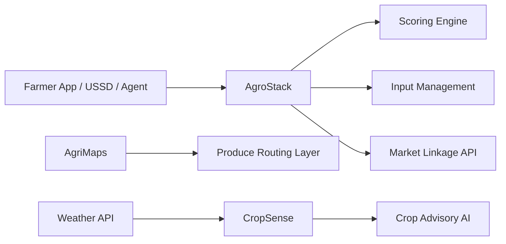

# 🌾 Open Source AgriTech Projects – Research Lab

## 🚜 Building Infrastructure for the Future of Agriculture

Welcome to the **TechOps Apex AgriTech OSS Portfolio** — a focused suite of developer-first tools and infrastructure projects designed to empower farmers, cooperatives, and agriculture-focused startups. We’re committed to creating open systems that enable food security, economic access, and sustainable agri-ecosystems.

---

---

## 🎯 Problem Spaces We Address

| Area               | Description |
|--------------------|-------------|
| 👨🏾‍🌾 Farmer Inclusion    | Onboarding, data records, and identity management for farmers |
| 💰 Agri-Finance         | Credit scoring, SACCO integration, and input financing models |
| 🌐 Market Access        | Logistics, produce tracking, and demand matching |
| 📊 Agricultural Intelligence | Mapping, weather patterns, yield forecasting, and extension support |

---

## 📦 Projects Overview

### 🔹 [AgroStack: Farmer Services Platform](https://github.com/teambits009/agrostack)
> A backend-first toolkit for enabling farmer profiles, cooperatives, and agri-credit workflows

- 👤 Farmer identity and scoring engine
- 🌱 Crop calendar, cycle tracking
- 🔌 APIs for onboarding, cooperative management, and input loans

**Stack:** Django, GraphQL, PostgreSQL, Supabase

---

### 🔹 [AgriMaps: Agricultural Logistics Layer](https://github.com/teambits009/agrimaps)
> Toolkit for mapping, route optimization, produce movement, and market linkages

- 🗺️ GeoJSON-based offline maps
- 🚚 Produce logistics planning
- 📈 Market price feeds and aggregation

**Stack:** Leaflet.js, Python, FastAPI, SQLite

---

### 🔹 [CropSense: Yield Forecasting & Advisory](coming-soon)
> AI-powered insights for yield prediction, input recommendations, and weather-aware decisions

- 🌦️ Localized weather + soil modeling
- 🧠 ML-based crop prediction
- 🧪 Extension worker data sync

**Stack:** Scikit-learn, FastAPI, LangChain, Hugging Face

---

## 🧭 AgriTech System Diagram

---

## 🛠 Stack & Tools

| Tooling Category | Stack |
|------------------|-------|
| Backend          | Django, FastAPI, Node.js |
| Mapping          | Leaflet, OpenStreetMap, Mapbox |
| Data / ML        | Scikit-learn, Pandas, LangChain |
| DB / Infra       | PostgreSQL, Supabase, SQLite, Redis |
| Frontend         | React Native, USSD interfaces, PWA |

---

## 📬 Want to Collaborate?

- 💬 Email: [brandon@techopsapex.com](mailto:brandon@techopsapex.com)
- 🌱 LinkedIn: [TechOps Apex](https://linkedin.com/company/techopsapex)
- 🐙 GitHub: [@teambits009](https://github.com/teambits009)

---

> _"Feeding the future starts with open technology today."_

---

Made with 💚 by **TechOps Apex – AgriTech Team**

