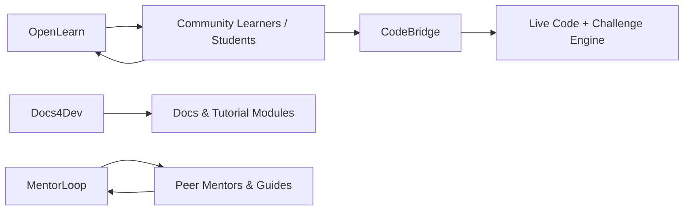

# 🎓Open Source EduTech Projects - Research Lab
## 🌍 Open Education Tools for the Next Billion Learners

Welcome to the **TechOps Apex EduTech OSS Portfolio** — a growing collection of open-source, community-powered tools designed to enable **accessible, localized, and impactful tech education** across emerging regions. We build for learners, educators, institutions, and communities driving digital transformation through knowledge.

---

---

## 🧠 What We Focus On

| Area                     | Description |
|--------------------------|-------------|
| 🧑‍💻 Developer Training     | Self-paced and mentor-led learning platforms |
| 📚 Curriculum & Docs      | Localized, modular content across tech stacks |
| 🌐 Access & Inclusion     | Offline-ready tools, language localization, accessibility |
| 🤝 Community Mentorship   | Cohorts, capstones, and peer-based learning loops |

---

## 📦 Projects Overview

### 🔹 [OpenLearn LMS: Self-Hosted Learning Platform](https://github.com/techopsapex/openlearn)
> Lightweight, customizable LMS for developer and digital skills training

- 📁 Markdown + Git-powered content authoring
- 🌍 Multilingual interface with offline-friendly modes
- 🧩 Module tracking, quizzes, and gamification-ready

**Stack:** React, Node.js, SQLite, Docusaurus, GitHub Actions

---

### 🔹 [CodeBridge: Interactive Learning Playground](coming-soon)
> In-browser coding practice & project-based tutorials for junior devs

- 💻 Beginner-friendly coding environment (HTML, CSS, JS, Python)
- 🎯 Community challenges, real-world mini projects
- 📊 Progress tracking + mentor feedback channels

**Stack:** Next.js, Monaco Editor, Firebase, WebAssembly (for sandboxing)

---

### 🔹 [Docs4Dev: Open Curriculum & Translation Framework](in-progress)
> Open-source technical docs, tutorials, and localization pipelines

- ✍️ Technical writing templates for DevOps, AI, Git, APIs, etc.
- 🌍 Translation-ready with i18n support (Swahili, French, Amharic)
- 📦 Offline deploys and PDF generation for rural campuses

**Stack:** MkDocs, GitHub Pages, Crowdin, Pandoc

---

### 🔹 [MentorLoop: Cohort & Mentorship Toolkit](coming-soon)
> Tools to support contributor programs, community learning, and 1:1 mentorship

- 🔁 Capstone project tracking and peer-review cycles
- 🧑‍🏫 Mentor-matching bot and progress monitoring
- 📆 Session scheduling and feedback workflows

**Stack:** Django, Discord/Slack API, PostgreSQL, Notion API

---

## 🗺️ System Architecture Map

---

## 🛠 Tech Stack

| Category        | Tools |
|----------------|-------|
| LMS & Docs     | Docusaurus, MkDocs, GitBook |
| Frontend       | React, Next.js, Tailwind CSS |
| Backend        | Node.js, Django, Firebase |
| Sandboxing     | WebAssembly, Docker |
| Infra/CI       | GitHub Actions, Netlify, Supabase |
| Localization   | Crowdin, i18n, Polyglot.js |
| Community Tools| Discord, Notion API, Slack SDK |

---

## 💸 Why We Fund EduTech Projects

We believe access to quality tech education is a **foundational right**. Funding enables us to:

- 💻 Sponsor contributors and create paid learning internships  
- 📹 Produce high-quality educational content and tutorials  
- 🌍 Translate and localize content across multiple languages  
- 🏫 Partner with schools, bootcamps, and local orgs  
- 📦 Build accessible, open learning infrastructure for the world

Want to co-fund a project, sponsor a mentorship program, or support a regional deployment?

📬 **Reach out:** [brandon@techopssapex.com](mailto:brandon@techopssapex.com)

---

## 🚀 Join the Learning Revolution

We’re building the open-source future of education—**for and with the community.**

- 🤝 Contribute to live projects or propose your own
- 📚 Use our platforms in your bootcamp, school, or community hub
- 🌍 Help us localize, document, and spread learning access globally

🔗 Browse the `/projects` directory to see what’s active  
🗃️ Proposals and funding ideas in [`/funding-proposals`](../funding-proposals)  
💬 Join our Discussions or open an Issue to get involved

---

> _"Education is the ultimate equalizer — let’s make it open, local, and limitless."_  

---

Made with 💙 by **TechOps Apex – EduTech Division**

---

Let me know if you want a version tailored for a specific initiative (like a bootcamp series or DevRel curriculum), or one that breaks into subfolders with icons/logos for each project!
