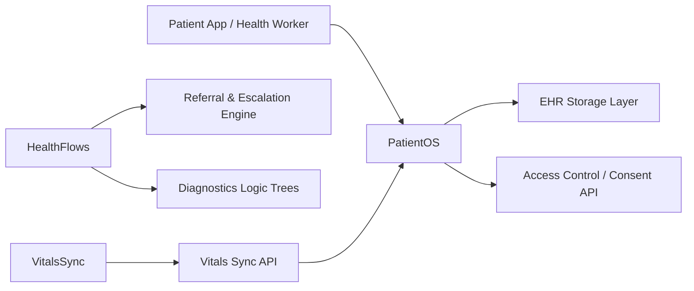

# 🏥 TechOps Apex – Open Source HealthTech Projects

## 🌍 Health Systems for the People, Built in the Open

Welcome to the **TechOps Apex HealthTech OSS Portfolio** — a growing collection of modular, open-source solutions designed to power digital health ecosystems, especially in underserved or distributed environments. Our tools support frontline workers, community clinics, health startups, and public health innovators.

---

---

## 🩺 What We Focus On

| Area                  | Description |
|-----------------------|-------------|
| 👥 Patient Management | Digital health records, identity, continuity of care |
| 📲 Remote Diagnostics  | Community health flows, mobile-first tools |
| 📊 Health Intelligence | Dashboards, forecasting, public health data models |
| 🔐 Consent & Privacy   | Patient-first data design, audit trails, secure sharing |

---

## 📦 Projects Overview

### 🔹 [PatientOS: Modular Health Record System](https://github.com/teambits009/patient-os)
> Build portable, local-first, and privacy-aware electronic health records (EHRs)

- 🗃️ Modular health workflows (ANC, outpatient, immunization)
- 🔌 FHIR-inspired schema with support for offline sync
- 🛡️ Patient consent, PIN-based access, and multi-facility transfers

**Stack:** CouchDB, PouchDB, React Native, Node.js

---

### 🔹 [HealthFlows: Remote Diagnostics Toolkit](https://github.com/teambits009/healthflows)
> Tools for diagnostics, community outreach, referral workflows, and health worker assistance

- 🔍 Diagnostic logic trees & symptom flows
- 🤝 Referral and escalation handling
- 📲 Mobile-first UI + USSD mode for low-connectivity areas

**Stack:** Django, Flutter, PostgreSQL, Twilio API

---

### 🔹 [VitalsSync: Health Devices Integration Layer](coming-soon)
> Lightweight integration layer to sync vitals from IoT or medical-grade devices to record systems

- 🩺 Pulse, BP, and temperature syncing
- 🧬 Open API for integration into local/NGO systems
- ⚡ Real-time alerts for abnormal readings

**Stack:** FastAPI, MQTT, SQLite, React

---

## 🧭 System Architecture Map

---

## 🛠 Tech Stack

| Category        | Tools |
|----------------|-------|
| Frontend       | React Native, Flutter, Tailwind |
| Backend        | Django, Node.js, FastAPI |
| Data Sync      | PouchDB, CouchDB, MQTT |
| Infra/Storage  | PostgreSQL, SQLite, Redis |
| Messaging/API  | Twilio, REST, WebSockets |

---

## 📬 Join the HealthTech Movement

- 💌 Email: [brandon@techopsapex.com](mailto:brandon@techopsapex.com)
- 👨🏽‍⚕️ LinkedIn: [TechOps Apex](https://linkedin.com/company/techopsapex)
- 🐙 GitHub: [@teambits009](https://github.com/teambits009)

---

> _"We believe equitable healthcare starts with open and interoperable systems."_

---

Made with 💙 by **TechOps Apex – HealthTech Division**

