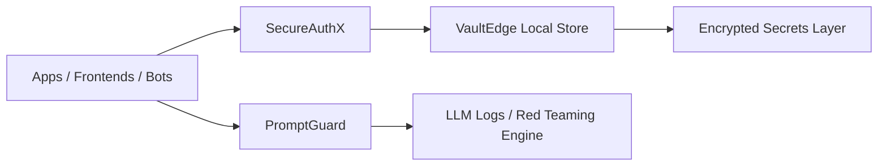

# 🔐 Open Source Cyber_Security Projects - Research Lab

## 🛡 Building Secure, Trustworthy, and Privacy-First Infrastructure

The **TechOps Apex Security OSS Portfolio** showcases a growing suite of tools that enable secure systems design, privacy-centric user experiences, and verifiable compliance. We focus on developer-friendly solutions for securing fintech, healthtech, agritech, and AI-powered products across distributed environments.

---

---

## 🔍 Focus Areas

| Security Domain       | Description |
|------------------------|-------------|
| 🔐 Auth & Identity     | API auth, decentralized identity, device-bound auth |
| 🧾 Data Privacy         | Consent, access controls, privacy-preserving design |
| 🧠 Secure AI & Ops     | LLM audit trails, prompt injection protection |
| 🧑🏽‍💻 Developer Security | API keys, secrets scanning, local-first vaults |

---

## 📦 Project Catalog

### 🔹 [SecureAuthX: Modular Authentication Toolkit](https://github.com/teambits009/secureauthx)
> Identity and access management with support for OTP, social login, device trust, and API tokens

- 🔐 JWT + refresh token flows
- 🧭 Device fingerprinting + behavioral checks
- 🔁 OAuth2, phone/email OTP, and webauthn (coming soon)

**Stack:** Node.js, PostgreSQL, Redis, Supabase Auth

---

### 🔹 [VaultEdge: Secrets Manager for Local & Edge Devices](https://github.com/teambits009/vaultedge)
> Lightweight vault for storing environment secrets, API keys, and encrypted payloads at the edge

- 🧱 Encrypted local vault with secure sync
- 📥 Secure CLI and REST interface
- 🖥️ Designed for IoT, mobile, and PWA use cases

**Stack:** Rust, SQLite, WebCrypto, Electron

---

### 🔹 [PromptGuard: LLM Security Middleware](https://github.com/teambits009/promptguard)
> Middleware layer for protecting against prompt injection and monitoring AI interactions

- 🧠 Prompt sanitization and pattern matching
- 📊 Interaction logs with scoring and alerts
- 🔒 Red teaming API to test model exposure risks

**Stack:** Python, FastAPI, LangChain, GPT-4

---

## 🧭 High-Level Security Architecture

---

## 🧰 Tools & Technologies

| Category       | Stack |
|----------------|-------|
| Auth           | Supabase, JWT, OAuth2, Webauthn |
| Secrets Vault  | SQLite, Rust, WebCrypto, Electron |
| AI Middleware  | FastAPI, LangChain, GPT APIs |
| Storage & Infra| Redis, PostgreSQL, Docker, Edge Workers |

---

## 👥 Get Involved

- 📧 Email: [brandon@techopsapex.com](mailto:brandon@techopsapex.com)
- 🌐 LinkedIn: [TechOps Apex](https://linkedin.com/company/techopsapex)
- 🐙 GitHub: [@teambits009](https://github.com/teambits009)

---

> _“Security by design, privacy by default — for every system, everywhere.”_

---

Made with ⚔️ by **TechOps Apex – Security Engineering Team**

